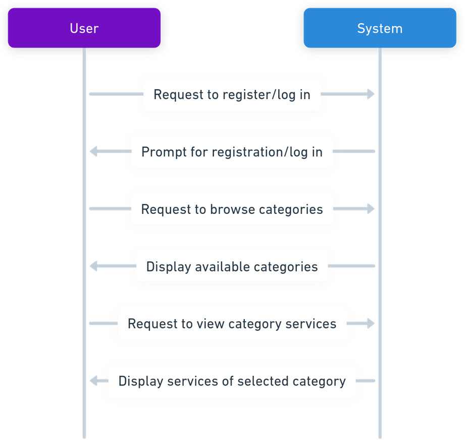
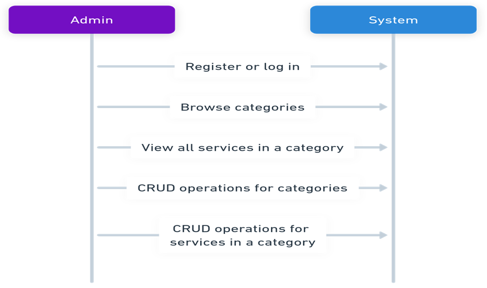

**it system:** 

**Description:** This backend application provides the core functionality for the IT Admin System. It handles data access, business logic, and API endpoints for various IT administration tasks.

**user ineractions**:



**admin ineractions**:



**Prerequisites:**

* Programming Language: 
- javascript
* Framework:
- express.js 
* Database:
- mysql

**Installation:**

1. Clone the repository:

```bash
git clone https://[repository_url].git
```

2. Install dependencies:

```bash
npm install
````

4. Running the application:
   
```bash
npm start
````

**Contributing:**

* If applicable, include guidelines for contributing to the project 


